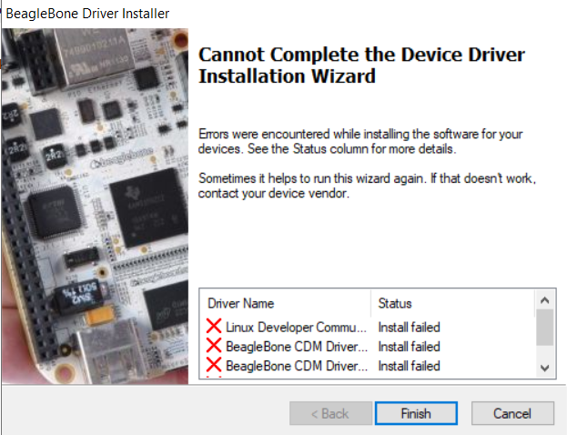
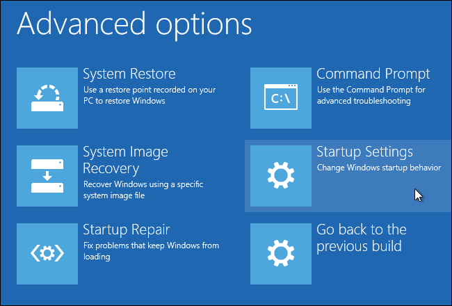

# Installing BeagleBone drivers


You are viewing the V1 Legacy SensorGnome user guide. This software has not been updated since 2018.


The drivers for BeagleBone SensorGnomes can be found in the table below (copied from the [BeagleBone homepage](http://beagleboard.org/getting-started)).&#x20;

| Operating System                                                                  | USB Drivers                                                                                                                                                                                                                           | Comments                                                                                                                                                                                                                                                                                                                                                                                                                                                                                                                                                                                                                                                                                                                                                                                                                                                                      |
| --------------------------------------------------------------------------------- | ------------------------------------------------------------------------------------------------------------------------------------------------------------------------------------------------------------------------------------- | ----------------------------------------------------------------------------------------------------------------------------------------------------------------------------------------------------------------------------------------------------------------------------------------------------------------------------------------------------------------------------------------------------------------------------------------------------------------------------------------------------------------------------------------------------------------------------------------------------------------------------------------------------------------------------------------------------------------------------------------------------------------------------------------------------------------------------------------------------------------------------- |
| 
Windows (64-bit)       

Windows (32-bit)
 | 
<a href="https://beagleboard.org/static/Drivers/Windows/BONE_D64.exe">64-bit installer</a>

<a href="https://beagleboard.org/static/Drivers/Windows/BONE_DRV.exe">32-bit installer</a>
 | 
If in doubt, try the 64-bit installer first.
<ul><li><strong>Note #1:</strong> Windows Driver Certification warning may pop up two or three times. Click "Ignore", "Install" or "Run"</li><li><strong>Note #2:</strong> To check if you're running 32 or 64-bit Windows see this: <a href="https://support.microsoft.com/kb/827218">support.microsoft.com/kb/827218</a>.</li><li><strong>Note #3:</strong> On systems without the latest service release, you may get an error (0xc000007b). In that case, please install the following and retry: <a href="https://www.microsoft.com/en-us/download/confirmation.aspx?id=13523">www.microsoft.com/en-us/download/confirmation.aspx?id=13523</a>.</li><li><strong>Note #4:</strong> You may need to reboot Windows.</li><li><strong>Note #5:</strong> These drivers have been tested to work up to Windows 10</li></ul> |
| Mac OS X                                                                          | 
<a href="https://beagleboard.org/static/Drivers/MacOSX/RNDIS/HoRNDIS.pkg">Network</a> <a href="https://beagleboard.org/static/Drivers/MacOSX/FTDI/EnergiaFTDIDrivers2.2.18.pkg">Serial</a> 
                              | Install both sets of drivers.                                                                                                                                                                                                                                                                                                                                                                                                                                                                                                                                                                                                                                                                                                                                                                                                                                                 |
| Linux                                                                             | [mkudevrule.sh](https://beagleboard.org/static/Drivers/Linux/FTDI/mkudevrule.sh)                                                                                                                                                      | Driver installation isn't required, but you might find a few udev rules helpful.                                                                                                                                                                                                                                                                                                                                                                                                                                                                                                                                                                                                                                                                                                                                                                                              |

## If installation fails

On many newer computers, such as those with Windows 10, the operating system blocks the installation of the BeagleBone drivers as they are “unsigned.” The process may simply fail without an informative message.

The way around this is to temporarily disable this security check. Instructions on how to do that [can be found here](https://www.howtogeek.com/167723/how-to-disable-driver-signature-verification-on-64-bit-windows-8.1-so-that-you-can-install-unsigned-drivers/). Option 2 is the simplest and the security measures will revert after the next reboot. The steps are summarized below.

**1)** Hold down the Shift key while you click the “Restart” option in Windows. Your computer will restart into the Advanced Boot menu

2\) Select the “Troubleshoot” tile on the Choose an option screen that appears

3\) Select “Advanced options”

4\) Click the “Startup Settings” tile

5\) Click the “Restart” button to restart your PC into the Startup Settings screen

6\) Type “7” or “F7” at the Startup Settings screen to activate the “Disable driver signature enforcement” option

Your PC will boot with driver signature enforcement disabled and you’ll be able to install unsigned drivers. However, the next time you restart your computer, driver signature enforcement will be disabled—unless you go through this menu again.&#x20;
