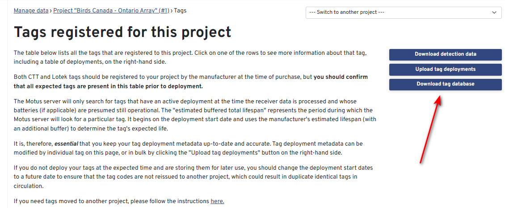
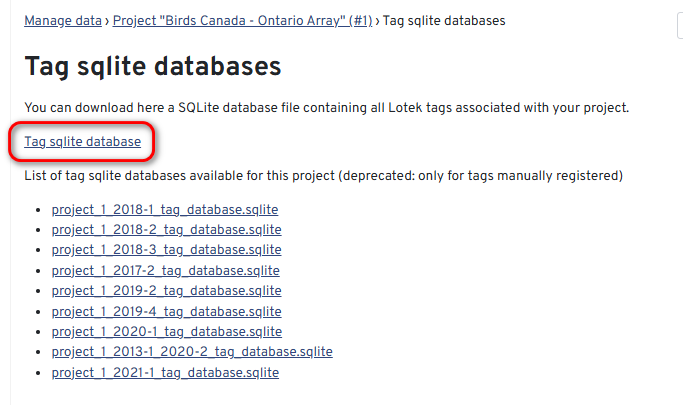

# Uploading a local tag database


You are viewing the V1 Legacy SensorGnome user guide. This software has not been updated since 2018.


## Introduction

If you are installing a SensorGnome or SensorStation that detects Lotek tags, it is often useful to know whether it is able to detect tags in real time, particularly if you are deploying tags in the vicinity. Thankfully this is possible by loading a local tag database on to the internal storage of the device. When the SensorGnome boots up, it checks for a tag database and will display any of those tags it "hears" on its web interface.

Viewing your live tag detections can also be useful when deploying tags or as a make-shift manual tracking device when a Lotek receiver is unavailable.


There are some **very** important differences to be aware of between the tagfinder that runs on a SG and the one that runs on the Motus Server.


The local tagfinder differs from the version found on Motus, in some key respects:

* It is only aware of the tags that you have provided, so its candidate list is minimal. It might therefore assign raw data to one of your tags even if a more suitable candidate exists in the Motus database
* It does not use deployment period or estimated battery life to assign data to candidate tags so it might "detect" a tag that has been dead for many years
* It uses none of the [filters that are applied](https://docs.motus.org/en/about-motus/how-data-are-processed/public-data-filters) on the Motus website (and in the R data)

All of this means that you will very often get different results on the local tagfinder as with data processed by the Motus server. Despite this, uploading a local tag database is recommended any time you are deploying tags.

## Steps

### Download the Tag Database

1. Navigate to your [project's tag management pages ](http://motus.org/data/project/tags)and click the "Download tag database" button

<figure><figcaption></figcaption></figure>

1. Download the first option. This will contain all the tags currently registered to your project.

<figure><figcaption></figcaption></figure>


The additional options seen above are an earlier, depcreated, format that was summarized by yearly quarter. These will only be visible for older projects, and will almost never be needed.


### Upload the tag database to your station

The following steps will differ depending on whether you are you using a SensorGnome or SensorStation

#### SensorGnome

1. [Connect to your SensorGnome](../connecting.md) with a computer using 'root' as both the username _and_ password and navigate to the [`uboot`](https://docs.motus.org/sensorgnome/appendix/cheatsheet#uboot-folder-configuration-files) folder. If using the V2 SensorGnome software, you can simply upload this via the web UI.
2. Rename the files `SG_tag_database.sqlite` with the suffix ‘old’, or delete them all together.
3. Copy the tag database you just downloaded from _motus.org_ into the `uboot` folder. Rename the file to `SG_tag_database.sqlite`
4. 5\. Reboot the SensorGnome.
5. 6\. Load [the SensorGnome's web interface](../webinterface.md) and scroll down to near the bottom of the page where it says "Tag Database" and verify the list of tags includes tags from your project.

#### SensorStation

1. Connect to the SensorStation with an Ethernet cable.
2. Navigate in a browser to `sensorstation.local`
3. Once the SensorStation web interface loads, scroll down to the very bottom and select "Browse" to choose the file on your computer. There is no need to rename the `.sqlite` file.
4. Click the red "Upload Tag Database File" button
5. After seeing the confirmation message scroll up and click the blue button "SensorGnome Interface" to confirm that your tags are there.

You are done! You can now view the ["live known tags" pane](../webinterface.md#pulses-and-tags-pane) at the top of the page to check whether your tags are being detected by this station.

## Merging multiple tag databases into one

As only one tag database can be loaded onto a SensorGnome at any given time, it is sometimes necessary to merge multiple tag databases together. You can use or modify the script below to merge multiple databases in R.

```
### merge tag databases ####
# This function accepts a vector of file names 
# corresponding to the various tag databases to be merged. 
# It saves one tag database containing all the source dbs
# named 'SG_tag_database.sqlite' for copying onto a SG
# It also returns a data frame with the results for visual overview

merge_dbs <- function(db_list, out_db = 'SG_tag_database.sqlite'){
  library(RSQLite)
  
  out_df <- data.frame()
  
  # loop through the list of tag dbs to be merged
  for (i in db_list) {
    message('Processing ', i)
    # establish SQLite connection to the current tag database
    con <- dbConnect(SQLite(), i)
    # select all from the tags table of the tag database, as a data frame
    df <- dbGetQuery(con, 'SELECT * FROM tags')
    # bind (append) the resulting rows to the consolidated out_df data frame
    out_df <- rbind(out_df, df)
    # disconnect from the source tag database
    dbDisconnect(con)
  }
  
  # open a SQLite connection to your output file
  outdb <- dbConnect(SQLite(), out_db)
  # write the results to the new consolidated tag database
  # This will overwrite any existing SG_tag_database.sqlite file 
  # if one already exists in the target directory
  dbWriteTable(outdb, 'tags', out_df, overwrite = T)
  # close the connection to the new consolidated tag database
  dbDisconnect(outdb)
  
  message(length(db_list), " tag sqlite files merged into ", out_db)
  
  return(out_df)
}

# An example of how to use this function...
# Call the function and pass in the paths of the tag databases to be merged.
merged_db <- merge_dbs(c('D:/Downloads/project_322_2020-2_tag_database.sqlite',
                         'D:/Downloads/project_322_2021-2_tag_database.sqlite'))

View(merged_db)
```
