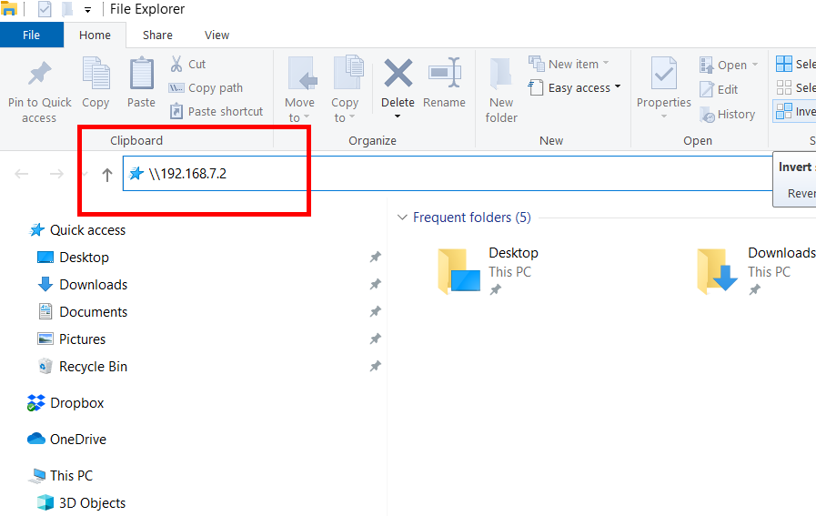
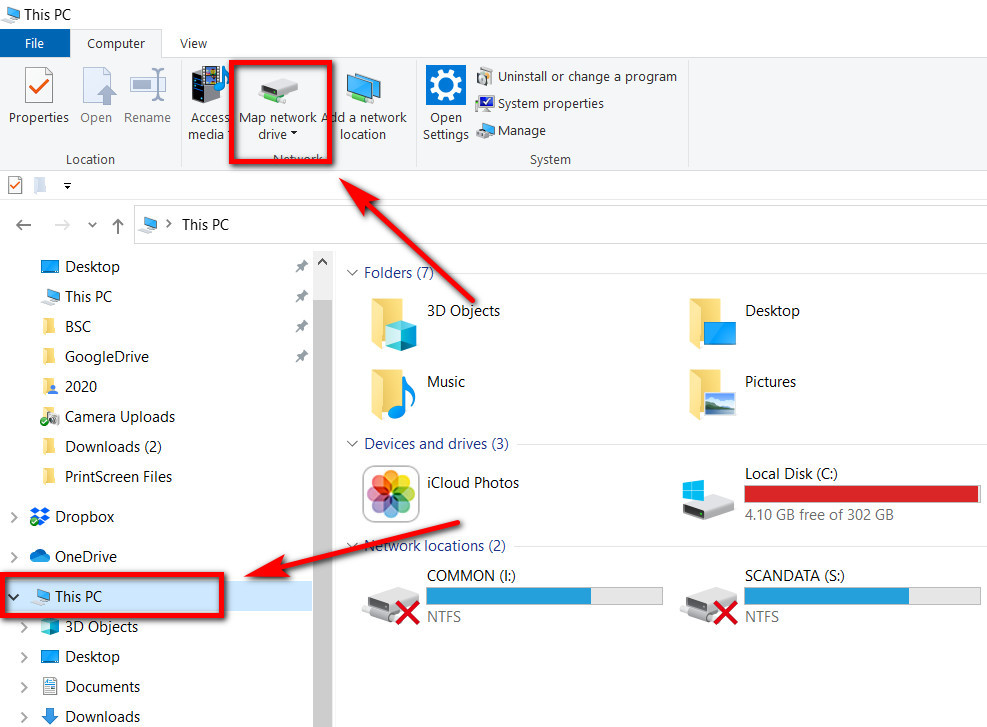
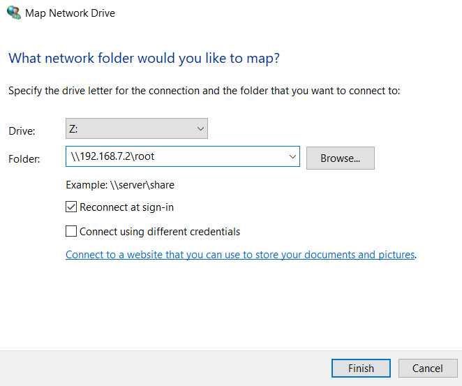
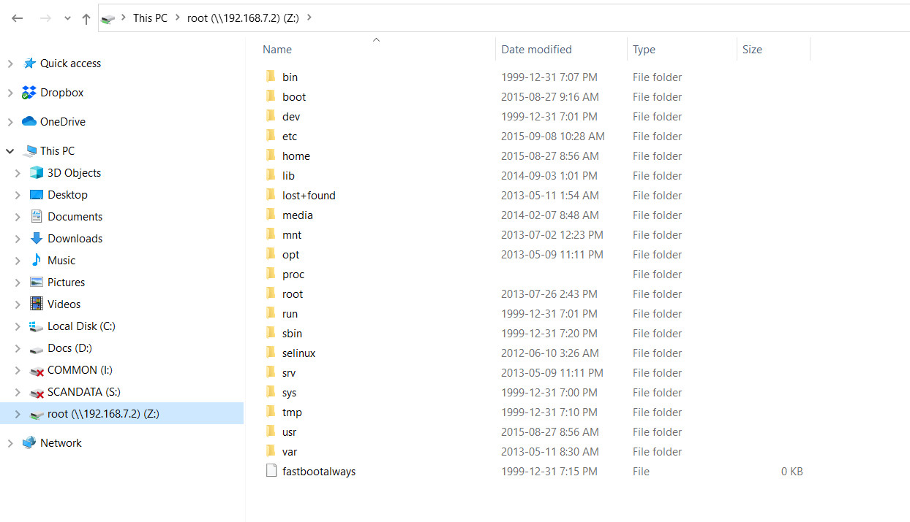

# Accessing BeagleBone as a network drive

Once a BeagleBone is connected to your computer, you can access it as a shared network drive either in Windows Explorer or the Mac equivalent. Through this method you can copy detection data as well as modify configuration files. It may also be possible to access data files on a BB even if you cannot access the Web Interface or create an FTP connection.&#x20;

This uses a connection protocol called SMBv1, which on newer versions of Windows has been disabled in favour of more secure version. You will likely have to re-enable this feature in order to access a BeagleBone as a networked drive.

There are instructions on doing that for Windows here: [https://www.windowscentral.com/how-access-files-network-devices-using-smbv1-windows-10](https://www.windowscentral.com/how-access-files-network-devices-using-smbv1-windows-10).

Once configured, you can navigate the file structure as you would any other drive by entering the following in the address bar: `\\192.168.7.2`

The folder structure will look a bit different than in FileZilla and you will see three folders: boot, data, root. There is overlap between these folders and you will find the same detection data in both data and root folders. However configuration files can only modified in the root folder.

* **Detection data (SGdata) folder on the MicroSD card**
  * `\\192.168.7.2\root\media\internal_SD_card\SGdata`
* **Internal detection data folder (when MicroSD card is absent or can't be read)**
  * `\\192.168.7.2\root\media\internal_system_memory\SGdata`
* _**uboot**_** folder (configuration files)**
  * &#x20;`\\192.168.7.2\root\boot\uboot\`

### Mapping the networked drive

You can save time in the future by "mapping" this new drive so it can be accessed more easily. Ensure that the BeagleBone is connected to your computer then open Windows Explorer. Click "This PC", then click "Map network drive".

After selecting "Map network" drive you will be be able to assign a drive letter as shortcut to drive. It's most convenient to map the drive to `\\192.168.7.2\root` as that will allow you to download detection and modify configuration files.

Once configured, you can access the folder by clicking on the link in Windows Explorer.

