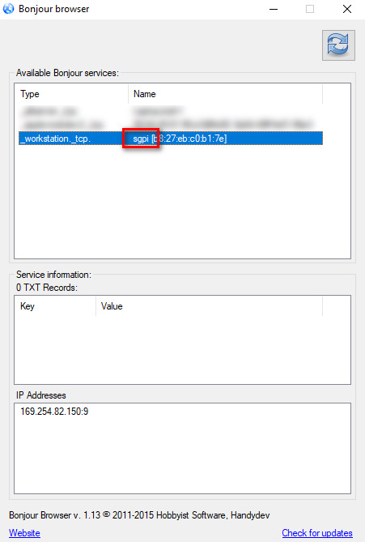
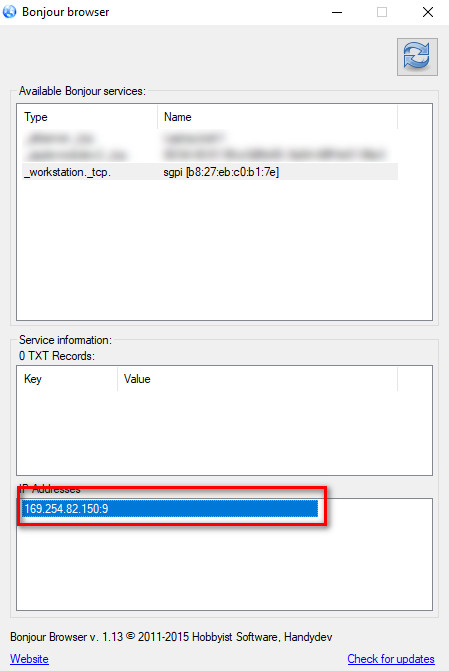
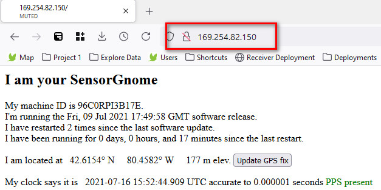

# Using Bonjour Browser to find the IP address


You are viewing the V1 Legacy SensorGnome user guide. This software has not been updated since 2018.


Typically a Raspberry Pi SG can be connected to using an Ethernet cable by visiting `http://sgpi.local` in either Firefox or a Chrome-based browser.

This method relies on networking software called Bonjour to establish the network connection between the RPi and your computer. Bonjour is installed as part of iTunes, but can also be downloaded separately from Apple. Mac computers come with Bonjour already pre-installed.

Sometimes, though, navigating to `http://sgpi.local` does not work, even with Bonjour installed. In these cases, you can use a third party software called Bonjour Browser to find the actual IP address of the RPi SG and access the Web Interface using that. 

**1\)** Connect the Raspberry Pi SG to your computer using an Ethernet cable and ensure the RPi has power supplied to it.

 **2\)** Download Bonjour Browser [from here](https://hobbyistsoftware.com/bonjourbrowser) and launch the program.

**3\)** Allow enough time for the connection to establish \(usually 30-60 seconds\) then hit the "Refresh" button in the top right hand corner of Bonjour Browser.

**4\)** Look for an entry whose name begins with "sgpi" and click on it.

**5\)** Copy the IP address in the bottom pane

**6\)** Paste the IP address into the address bar of Firefox or Chrome _without the port number \(the colon and the numbers following it\)_

**7\)** You should now see the Web Interface.

