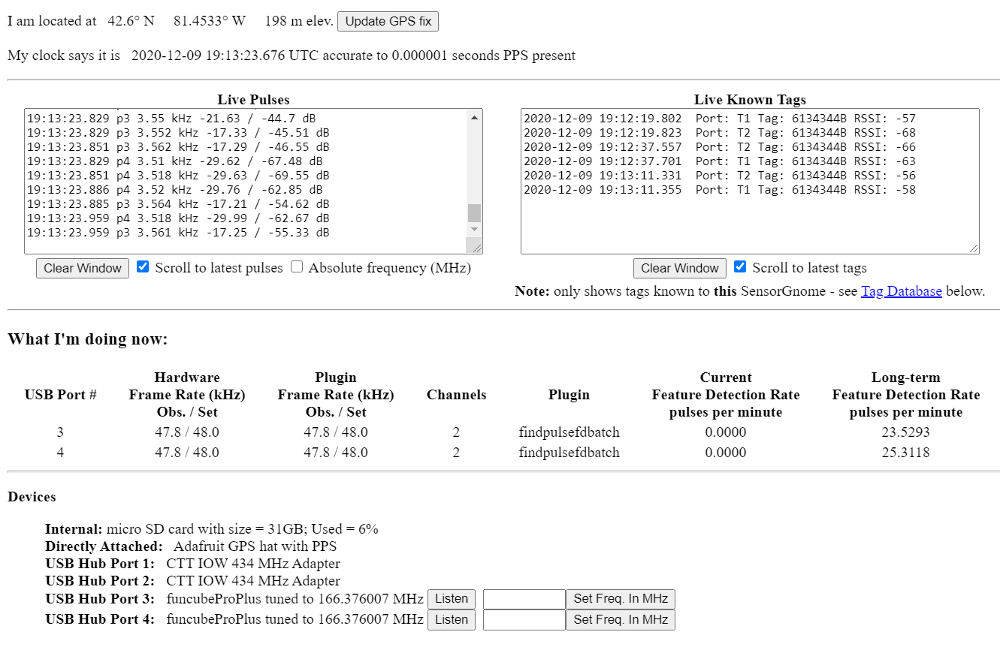

# CTT LifeTag Compatibility \(dual-mode\)

By default a SensorGnome is capable of detecting only Lotek Nanotags. However by applying a software patch a SensorGnome can also detect CTT LifeTags/ PowerTags. We refer to SGs that are listening for both tag types as “dual-mode” SensorGnomes. 


_You will not be able to use the same dongles for CTT tags as you use for Lotek tags. For CTT-compatible dongles, contact_ [_CTT_ ](https://store.celltracktech.com/products/lifetag-motus-adapter)_or Birds Canada._


**1\)** Download the CTT compatibility patch from the link below

* **Raspberry Pi.**  [2019-11-12-rpi\_ctt\_dongle.tar.bz2](https://s3.amazonaws.com/media.celltracktech.com/sensorgnome/raspberry/2019-11-12-rpi_ctt_dongle.tar.bz2)
* **BeagleBone.** BB SG's are capable of dual-mode function, but currently some steps on the back-end are required to enable this. If you wish to make a BB SG dual-mode, please [contact Motus](mailto:motus@birdscanada.org) and we will assist you.

**2\)** Rename the downloaded file to `sensorgnome_update.tar.bz2`

**3\)** Navigate to the `uboot`folder of your SG



#### Raspberry Pi _uboot_ folder \(configuration files\)

* FTP connection \(e.g. in FileZilla\)
  * `/dev/sdcard/uboot`
* Directly on MicroSD card when removed from powered-down RPi
  * `/uboot`



#### BeagleBone _uboot_ folder \(configuration files\)

* FTP connection \(e.g. in FileZilla\)
  * `/boot/uboot`
* Shared network drive \(e.g. in Windows Explorer\)
  * `\\192.168.7.2\root\boot\uboot\`




If you keep a copy of the Raspberry Pi SG software on your computer, you can simply copy in the CTT patch into the _uboot_ folder on your computer \(once renamed to "sensorgnome\_update.tar.bz2"\). Now every time you load this software onto a Raspberry Pi, it will be dual mode by default.


**4\)** Copy the renamed software patch into this folder

**5\)** Power down and reboot the SG.

**6\)** Once powered up, connect to the SG and open the Web Interface

If the process was successful you should see any attached CTT dongles in the "Devices" pane of the Web Interface. However, they will **not** be displayed in the "What I'm doing now" pane. Additionally, both of these panes will _only_ be displayed if there is a Nanotag-compatible dongle, such as a FUNcube dongle, attached.

It's possible that you will also see CTT tag IDs in the Live Known Tags section. These may be the signals of actual tags in the vicinity, or they be the product of background radio noise that happens to resolve to a tag ID, which is still useful in confirming that the SG is in fact listening for CTT tags. CTT tag hits will never show up in the Live Pulses Pane as this pane only displays radio pulses consistent with Lotek tag signals.

 


It sometimes requires two complete boot cycles of the SG for this process to succeed, so if you don't see your CTT dongle even though you have both a FUNcube and CTT dongle attached, reboot and try again.


