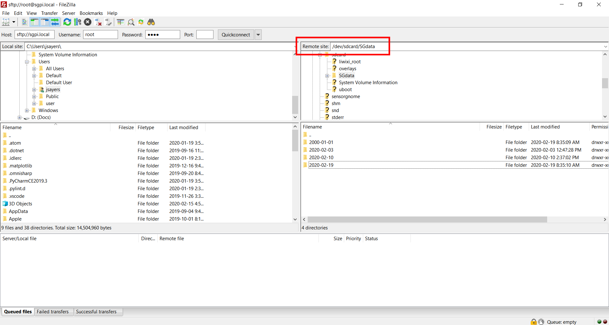
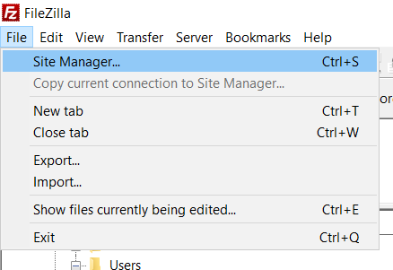
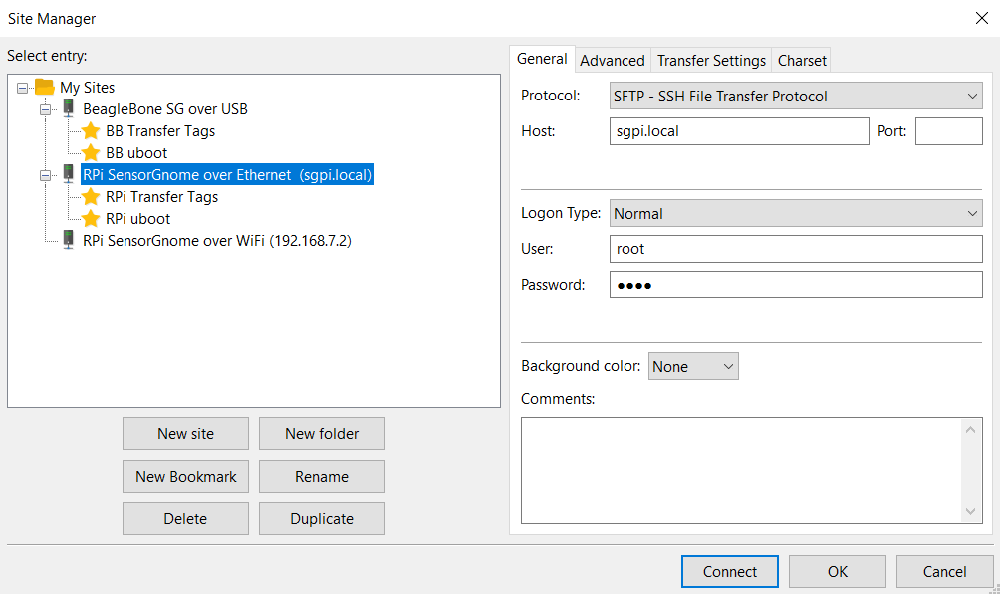
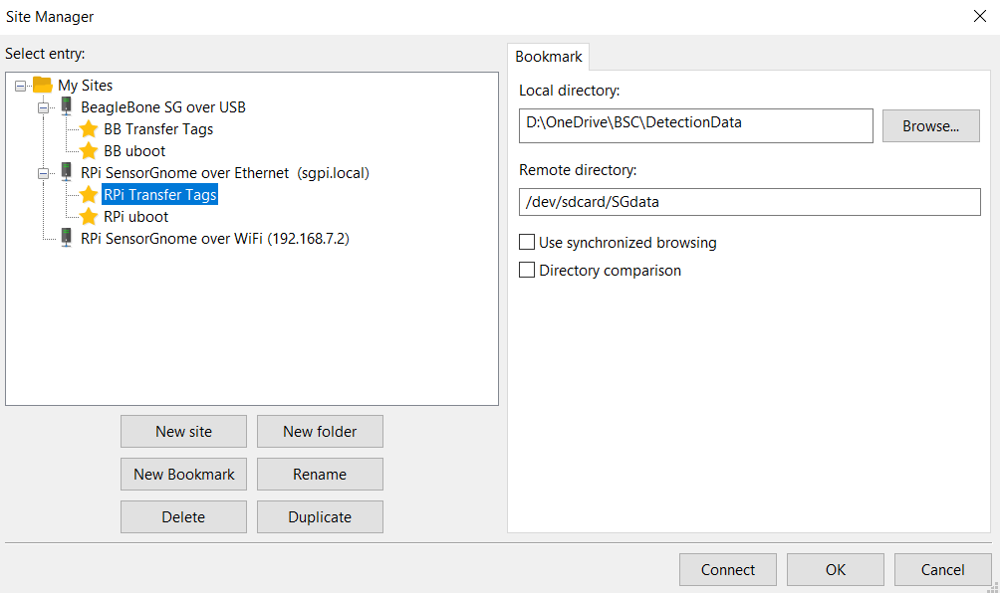

# Establishing an FTP connection

The recommended method of transferring the detection data and other files between the SG and your computer is with an FTP connection. We suggest the free and open-sourced FTP client [FileZilla](filezilla-project.org/), which is what these instructions here are based on, though any FTP client will do. The instructions given here are referred to throughout the rest of this guide.

**1\)** Connect to your SensorGnome using the instructions above. Confirm you are connected by accessing the Web Interface. If you cannot access the Web Interface there is a very good chance you will not be able to establish an FTP connection either. 

**2\)** Open FileZilla and enter the following credentials in the top left bar, depending on what type of SG you have and how you connected.



#### **Raspberry Pi using an Ethernet cable**

* host: `sftp://sgpi.local`
* username: `root`
* password: `root`

#### **Raspberry Pi using the Wi-Fi Hotspot**

* host: `sftp://192.168.7.2`
* username: `root`
* password: `root`



#### **BeagleBone using USB**

* host: `sftp://192.168.7.2`
* username: `root`
* password: `root`



**3\)** Click “Quickconnect”

* _The first time you connect to a particular SG you may see a pop-up warning that the “server’s host key is unknown.” If you entered the connection credentials correctly, click “OK” and continue._

**4\)** Once connected, you’ll need to navigate to the appropriate folder on the Remote site \(aka the SensorGnome\) for the next step. There are two main locations you’ll be working with: the **SGdata folder**, where the detection data files are stored, and the **uboot folder**, where certain configuration files are stored. You can click around through the folders in the right hand panes to get to these locations but it’s easier to cut and paste the address directly into the location bar on the top right panel.



#### **Raspberry Pi**

* SGdata folder: `/dev/sdcard/SGdata`
* uboot folder: `/dev/sdcard/uboot`



#### **BeagleBone**

* SGdata folder: `/media/internal_SD_card/SGdata`
* uboot folder: `/boot/uboot`




To save time later, you can add site-specific bookmarks in FileZilla containing both the connection credentials as well as the folder paths to be navigated to. Then you can simply click on the appropriate shortcut and proceed automatically through the steps above. This isn’t necessary, but can speed up your work process later on if configured. 


In FileZilla, select File &gt; Site Manager

Select “New Site” and give it the name and credentials specific to that site. In the example below, there are three sites saved, one for each of SG/connection type combinations

Then under the desired site, click “New Bookmark” and assign the desired path. The paths for downloading detection data or modifying configuration files are found in the relevant sections below. for detection data, you may also want to assign the folder on your computer where you’ll be saving detection data, as in the example below.

Once configured, you can connect to the SG and navigate to the proper folders on your computer and the SG with just one click. 

