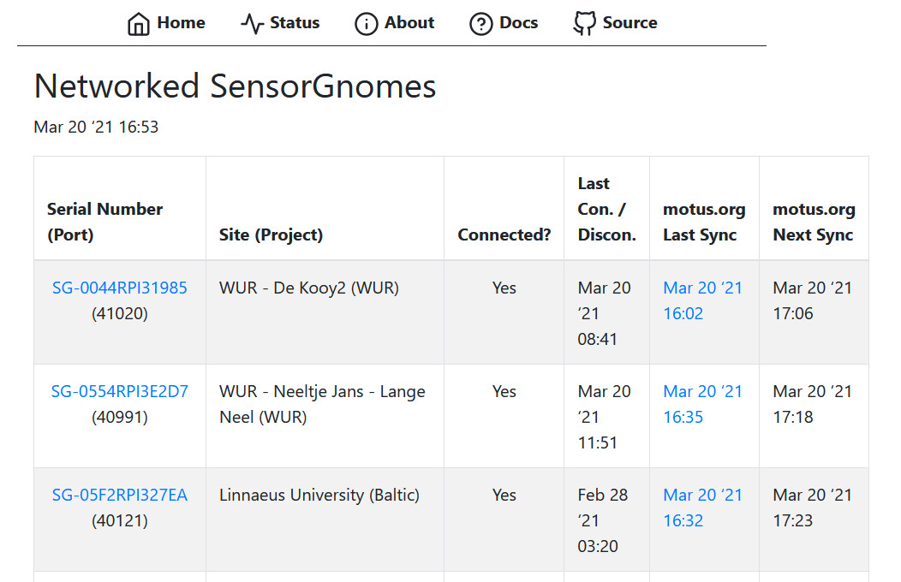
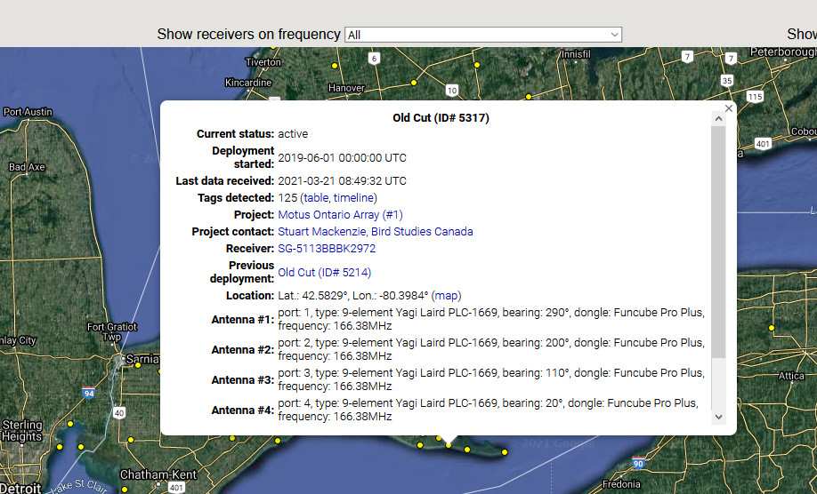

# Data Syncing over the Internet

Configuring your SensorGnome to sync detection data automatically result in more up-to-date data, fewer trips to visit a station, and more timely identification \(and resolution\) of any issues the receiver. Wherever possible, SG's should be connected to the Internet.

## Option 1: Wired internet over Ethernet

The simplest method of syncing data over the internet is to plug the BB or RPi into the Internet via an Ethernet cable. If the internet is not password protected, and the software on the SG is up-to-date, this should happen automatically within minutes.

## Option 2: Wi-Fi 

Connecting over a Wi-Fi network is also an option. In this case a bit of configuration is needed. The Raspberry Pi comes with a Wi-Fi adapter already on-board. Wi-Fi connectivity is also possible with a BeagleBone, though it requires a USB Wi-Fi adapter. The BeagleBone software is configured to work with the [TP-Link TL-WN725N Wi-Fi adapter](https://www.tp-link.com/us/home-networking/usb-adapter/tl-wn725n/). This is an affordable and reliable Wi-Fi adapter that is available from multiple retailers.


The Wi-Fi network you wish to use must be configured with WPA2 security. This is the standard on most Wi-Fi networks already. An SG will _not_ connect to a Wi-Fi network that has no password.


1. Connect to the SG
2. Open FileZilla and establish an FTP connection with the SG
3. Navigate to the uboot folder
4. Right click on the `network.txt` file and select “edit”
5. Follow the instructions in the file and enter the appropriate network name and password
6. Ensure that the changes have been saved to the SG, then power down and reboot
7. Confirm that the SG is connected by visiting [sensorgnome.org/status](sensorgnome.org/status). 

_Note: Activating the WiFi hotspot will temporarily disable the connection to the Internet. One the WiFi hotspot turns off, the connection to the Internet will be re-established._

## Checking sync status on sensorgnome.org/status

You can check the sync status of your networked SensorGnome by visiting [sensorgnome.org/status](http://www.sensorgnome.org/status). This page displays a master list of SensorGnomes that are, or have recently been, connected to the Internet.

The list is is long as it includes receivers from all projects, and deployment names don't always appear \(especially if the deployment is a test deployment\) so the simplest way of finding your SensorGnome is to hit `CRTL F` in the browser and then type in the receiver **serial number**. 

The middle column shows the time of the most recent data sync \(in UTC/GMT time\). For a properly functioning station, this should be within the last few hours. 

The first column -- most recent connect/disconnect time is mos useful immediately after powering up or connecting an SG for the first time. Within a minute or so of connecting to the Internet, an SG will show up on this list and you should see the recent time displayed. The first sync won't be attempted for another hour or two \(the time displayed in the last column\), so check back in later to confirm that data is actually being synced. 

This is the first place to check to see if a recently connected SG seems to be properly connected to the Internet. However the true test for whether your station is syncing properly is to check if recent data has made it to the Motus database. The quickest way of doing this is on the [receiver map](https://motus.org/data/receiversMap?lang=en), which by default shows all the currently active Motus stations in the network.

