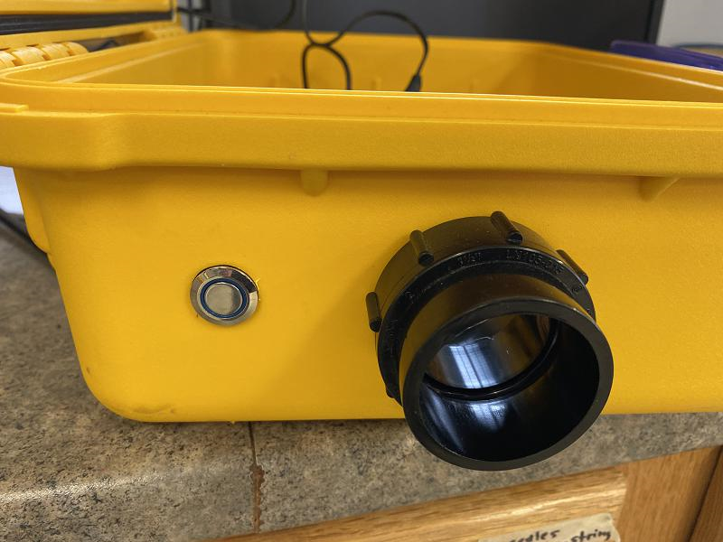
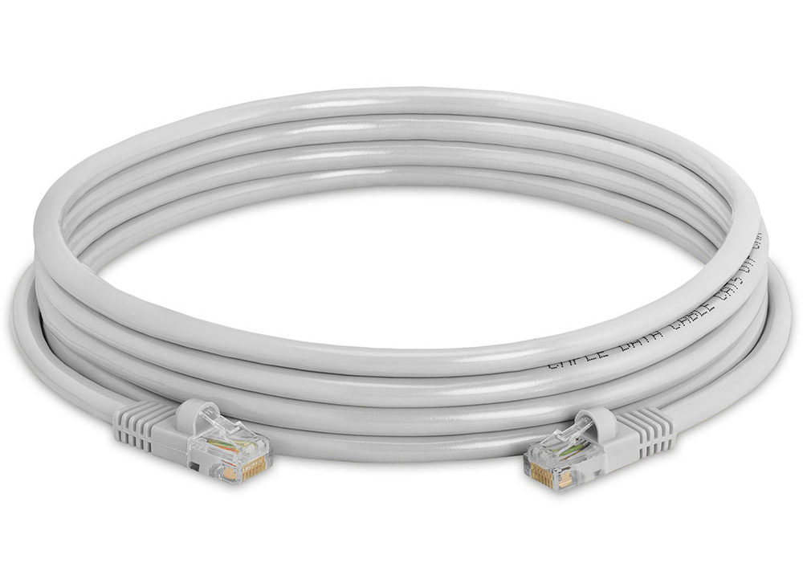
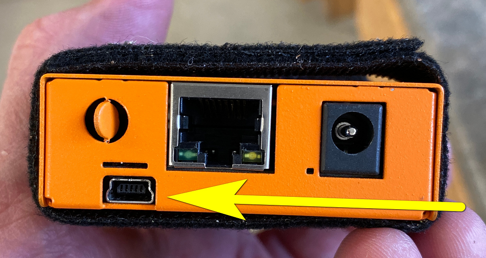

# Connecting to your SensorGnome

In order to download raw detection data, to check the SG’s live status in the Web Interface, or to apply a software patch, you must establish a connection between the SensorGnome and your computer. The actual method used will depend on whether you are using a RPi or BB SG, but the end result is similar in each case. Click on the appropriate tab below to switch between instructions for Raspberry Pi and BeagleBone SGs.



### Raspberry Pi SensorGnome

There are two methods available for connecting to a RPi SG: Wi-Fi Hotspot or Ethernet cable. Wi-Fi hotspot can be more convenient, but not every RPi SG is equipped with this functionality. Ethernet cable should work in every case \(provided you have iTunes installed on your computer, in the case of Windows users\).

### Option 1: Wi-Fi Hotspot

The RPi that powers the SG is capable of producing a local Wi-Fi hotspot that a computer or smartphone can connect to. This doesn’t connect to the internet, but simply forms a network connection between the SG and your computer.

An RPi SG with the ability to create a hotspot will have a silver button somewhere on the outside of the SensorGnome case. This button is used to activate the hotspot. If there is no button then it will not be capable of creating a hotspot and you will have to connect with Option 2: Ethernet Cable.

The Wi-Fi hotspot is convenient because, once a computer \(or smartphone\) has connected once to that particular RPi SG, it will not require any additional configuration and all further interactions with that SG can be performed by pressing the Wi-Fi button and leaving the SG case itself closed.

The disadvantage is that activating the Wi-Fi hotspot via the button can be finicky. Sometimes it takes several tries, and sometimes it doesn’t work at all.

1. Activate the Wi-Fi hotspot by double pressing the Wi-Fi button on the SG case. If properly activated the button will commence a slow on/off blinking pattern \(the actual pattern of the blinking may vary\).
2. The Wi-Fi hotspot should soon appear in the list of available Wi-Fi networks to connect to. The name of the Wi-Fi Network and the password will be the same as the serial number of the RPi SG \(e.g. SG-A123RPI43D3\).
   * It can take up to a minute for the Wi-Fi network to appear.
   * The LED light in the button is usually bright enough to view in sunlight, but occasionally it is very faint and difficult to see
   * The timing of the double press can be finicky and difficult to activate. If it doesn’t work, try it again.
3. Connect to the new Wi-Fi network. The password is the same as the network name, which is the same as the serial number of the RPi SG. This is just a local network so there won’t be any internet once connected.

   The network name and the password are both the same as the SG serial number

4. After waiting 30-60 seconds, confirm that the connection is established by opening the Web Interface
   * Open a web browser \(Firefox or Chrome\)
   * Navigate to `http://192.168.7.2`
   * You should now see the SensorGnome Web Interface

### Option 2: Ethernet Cable

An Ethernet cable is usually the most reliable way of connecting to a RPi SG, and doesn’t depend on having a Wi-Fi hotspot activation button. No configuration is needed on the RPi. However some configuration may be required on your computer.

If you use a Windows computer, ensure that iTunes is installed. Installing iTunes also installs a networking tool called Bonjour that the SG relies on to establish the connection. If you don’t want to install iTunes, you can install [Bonjour by itself directly from Apple](https://support.apple.com/kb/DL999?locale=en_CA). If you use a Mac computer, Bonjour should already be installed.

1. Connect one end of the Ethernet cable to the Ethernet port on the Raspberry Pi and the other end to your computer
   * Many newer computers do not have an Ethernet port. If yours lacks an Ethernet port, you can use an “Ethernet to USB adapter” and connect to one of your computer’s USB ports.
2. After waiting 30-60 seconds, confirm that the connection is established by accessing the Web Interface
   * Open a web browser \(Firefox or Chrome\)
   * Navigate to `http://sgpi.local`
   * You should now see the SensorGnome Web Interface



### BeagleBone SensorGnome

The recommended, and often only, method of connecting to a BeagleBone SG is with a USB cable. Specifically this is a cable with a “standard” USB jack on one end, and a Mini USB jack on the other end. These aren’t as commonly found in day-to-day usage as they used to be but can still be found easily and for affordable prices online. Purchase a few so that you have a couple extras available.

**First steps:** Before connecting to a BeagleBone SG for the first time, it is likely you’ll need to install drivers. Drivers for your operating system can be found at [http://beagleboard.org/getting-started](http://beagleboard.org/getting-started), about halfway down the page. This only needs to be done once, though newer operating systems often block the process. If the driver installation fails refer to Appendix for guidance on how to install.

1. Connect the Mini USB end to the BeagleBone. The port is found on the same side as the 5V barrel jack and Ethernet port.
   * The USB connection will also power the BB by itself if needed. However if a primary power supply is already plugged in to the barrel jack, you can simply plug in the USB cable while the BeagleBone is powered on.

After 30 to 60 seconds, confirm that the connection is established by accessing the Web Interface

1. * Open a web browser \(Firefox or Chrome\)
   * Navigate to `http://192.168.7.2`
   * You should now see the SensorGnome Web Interface



##  Troubleshooting the Connection

An inability to access the Web Interface may indicate issues with your SensorGnome. However there are a number of other potential causes. Here are a few suggestions as part of the troubleshooting process if you

* Sometimes it takes a while for the connection to the SG to be established, especially for the Ethernet connection which may take up to a minute to establish. If you do not see the Web Interface, wait several seconds before trying again.
* If you try to access the Web Interface before the connection to the SG has been fully established, some browsers will automatically replace the `http://` prefix with `www.`. Confirm that the URL in the address bar begins with `http://` before trying again.
* Try a different connection method if you have the option
* Bonjour Browser \(placeholder to expand on this…\)
* Ensure you are using the correct URL for that SG and connection type
  * `http://192.168.7.2` if you are connecting with WiFi Hotspot
  * `http://sgpi.local` if you are connecting with Ethernet
* Make sure the cables you are using \(if applicable\) are connected properly
* Reboot and restart both the computer and SG
* Re-image the SG \(if it's a BeagleBone\) or try clean software version \(if it's a Raspberry Pi\)
* If you still cannot access the Web Interface, you will not be able to confirm that the SG is running properly. Don’t leave an SG deployed in the field in this condition unless you have no other option. There may still be a way of downloading data \(directly from the SD card for a RPi, or through a shared network drive for BB\).

